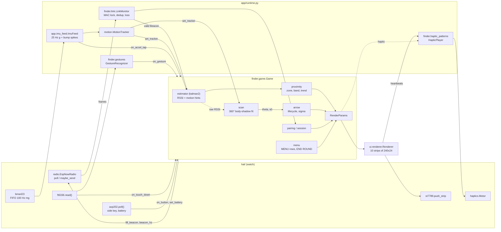
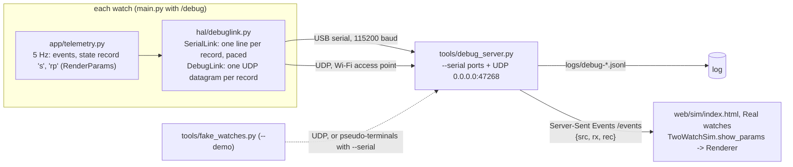

# Architecture

How the code is layered, what happens on each tick, and how fast things run.
Behaviour is defined in [`design/ui-spec.md`](design/ui-spec.md); the drivers
are described in [`../hal/README.md`](../hal/README.md). Terms such as
hysteresis and dwell are explained in the
[ui-spec glossary](design/ui-spec.md#13-glossary).

## Layers

| Layer | Where | Runs on | Depends on |
|---|---|---|---|
| Hardware abstraction | `hal/` | watch (and CPython/WASM against `tests/fakes/`) | `machine`, `network`, `espnow`, `socket`; `finder.compat` (ticks, `const`), `finder.link` (the radio's `TxScheduler`) |
| Game logic | `finder/` | watch, CPython, browser (MicroPython WASM) | nothing hardware-specific; `finder/compat.py` only |
| Renderer | `ui/` | watch, browser (needs `framebuf`, so MicroPython only) | `finder.tuning`, `finder.compat`; hint strings from `finder.scan`, `finder.pairing` |
| Watch runtime | `app/`, `main.py`, `boot.py` | watch (tested on CPython with fakes) | `hal.board.Board`, `finder`, `ui` |
| Simulation | `sim/` (+ `sim/webhost.py`, `web/sim/index.html`) | CPython, browser | `finder`, `ui` (webhost only) |
| Tooling | `tools/`, `tests/` | host (some scripts on the watch) | all of the above |

Rules that keep the layers apart:

- Only `hal/` imports `machine`, `network`, `espnow` or `socket` (and the
  CPython host tools in `tools/`). `app/runtime.py`
  receives hardware through `Board` parts and takes only constants and the
  watchdog from `hal`, so it runs against fakes.
- `finder/` never reads hardware or the clock by itself: every call takes a
  `t_ms` (ticks ms, compared only with `ticks_diff`). That is what lets one fake
  clock drive two games in the simulator and in `tests/test_episode.py`.
- The renderer reads **only** `RenderParams` (runes, menu rows and sun mode are
  fields too). It never sees estimator internals. `RenderParams` is
  JSON-serialisable (`to_dict` / `from_dict`). In debug mode (below) the watch
  sends it (5 Hz on Wi-Fi, about once a second on USB) and the web page draws
  it with the same renderer. No replay tool exists yet (R-08, R-14 in
  [user-research](research/user-research.md)): `app/telemetry.py` logs a
  5 Hz state subset to `/log`, not `RenderParams`, and the web simulator has no
  replay input. The debug bridge's `logs/debug-*.jsonl` sessions hold both, as
  the input for such a tool.
- Constants come from `docs/design/tokens.json` through `tools/gen_tuning.py`
  into `finder/tuning.py`, which the logic and the renderer share.

## Data flow per tick

One `Runtime.step(now)` (see the docstring in `app/runtime.py`) runs these
stages in order:

1. **radio**: `radio.poll()` drains ESP-NOW (at most 32 frames). Each frame goes
   through `LinkMonitor.on_packet` (locked to `game.pair.peer_mac`; bad and
   duplicate frames dropped), is unpacked into a `proto.Beacon` and passed to
   `game.on_packet(t_rx, mac, rssi, beacon)`. The game updates the partner view,
   feeds pairing/calibration, calls `est.update(t, rssi, peer_rssi, my_motion,
   peer_motion)` and, while scanning, `scan.on_packet` with the raw RSSI.
2. **imu**: `ImuFeed.poll` drains the BMA423 FIFO, averages each block of
   samples into one 25 Hz sample for `MotionTracker.add_sample` (steps,
   activity, stillness, tilt, face-up) and, while `game.bump_armed()` (HOT,
   FOUND, PAIRING seen / confirmed; the logic stage sets it each tick), samples at
   800 Hz and runs the bump spike detector on every sample
   (-> `game.on_accel_tap`). The FIFO decode and the per-sample loop
   (gravity, spike runs, block sums) are integer kernels compiled with
   `@micropython.viper` on the watch, after a self-check against their plain
   Python versions, which are what CPython, the wasm port and the browser
   run. Spikes inside haptic blanking are dropped (the motor shakes the
   accelerometer, so samples from the start of a buzz until 150 ms after it
   are ignored; HOT has no heartbeat for this reason). There are two blanking windows:
   ImuFeed's own, from the actual motor edges (`ImuFeed.blanked`, which the
   game also gets as `blank_fn`), and Game's `BlankWindow`, set for each haptic
   event it raises (also the only one in the simulator, which has no feed).
   `Game.blanked` ORs them and the scan uses it, so a tap must clear both. Once
   a second the optional feature engine adds chip steps and activity, and
   wrist-wear -> `game.on_wake` (only while the screen is off).
3. **touch**: `FT6336.read()` -> `GestureRecognizer` (multi-touch ignored).
   Touch is also sampled after a strip, at least 15 ms apart, while a frame
   renders (so a 60 ms tap measures right); what those samples find waits
   for this stage: `game.on_touch_down` when a finger landed
   (`GestureRecognizer.began`; the rain filter) and `game.on_gesture`, in
   time order: a press lands before its gesture; when a gesture ends on the
   sample where a new finger lands, the gesture goes first. It runs after
   imu: players knock the watches screen to screen, so a knock's spike is
   known when its touch's gesture arrives, and the game drops that gesture
   (ui-spec §8).
4. **button**: `AXP202.poll()` -> `game.on_button(t, long)`.
5. **logic** (every 100 ms): `game.set_tracker`, battery every 10 s, then
   `game.tick(t)`. Inside `tick`: the delivery meter (the share of the partner's
   beacons that arrived over the last 5 s) and `Proximity.update_est`
   turn the estimate into zone (with hysteresis and dwell), intensity, band and
   gated trend (WARMER/COLDER, shown only once the change is clearly bigger
   than the noise); the active mode runs (`pairing`, hunt with `arrow`, `scan`,
   link-lost, found, menu); FOUND is checked from the bump match; the result is
   one `RenderParams`. The battery reading also tells the game whether VBUS
   is present (`game.set_usb`: on USB the screen stays on). The runtime then
   applies screen power (the panel wakes dark; the backlight follows
   `params.backlight` after each rendered frame), and shuts the PMU down only
   once `game.power_off`.
6. **render** (on the frame lock, `app/pacer.py`): frames start on an even
   grid at the fastest of 20, 10, 8, 7, 6, 5 fps at or under `params.fps_cap`
   that the loop's measured cost fits, and `Renderer.frame(params, display,
   slot)` animates to the frame's slot time, so motion steps evenly (ui-spec
   §4 rule 6). It composes each 240x24 strip off-screen (a map of each pixel's ring number,
   coloured through a 256-entry palette of byte-swapped RGB565, then glyph and
   text overlays) and
   pushes it with `display.push_strip`. Strips go top to bottom, so the panel
   takes them as one window, all drawn in one buffer. The field is coloured
   from a quarter of the ring map, eight pixels a pass mirrored left-right
   and top-bottom (a viper kernel on the watch, checked against the framebuf
   path when the renderer starts; elsewhere a framebuf palette blit). With the screen off it runs with
   `display=None`, so ring and heartbeat timing continue. It returns only the
   heartbeat names, locked to ring spawns.
7. **tx**: when due, `game.fill_beacon` fills the 16-byte beacon (seq, own and
   filtered RSSI of the partner, steps, activity, battery, state byte, flags,
   bump age) and `radio.maybe_send` broadcasts it. `radio.set_rate` keeps the
   period at `1000 // game.beacon_hz` with about 10 % jitter from
   `TxScheduler`, so two watches never transmit in lock-step.
8. **haptic**: `params.haptic` (once, when its frame is first drawn, via
   `play_named`; telemetry logs it only if the player accepted it) and the
   renderer's heartbeats (`heartbeat`, one call per beat) go into
   `HapticPlayer`; `tick(now)` gives the motor level, applied by `Motor.set`
   only on change. The motor is also serviced after every strip, and in
   `idle` while a pattern plays.
9. **gc**: `gc.collect()` every 10 s when the next frame is at least 10 ms
   away (forced after 20 s). A collect sweeps the whole 4 MB SPIRAM heap
   (about 70 ms on the watch, bring-up), so it runs rarely; the loop's
   allocations take far longer than that to fill the heap.

`step` returns the ms to the next deadline; `run` sleeps that long (at most
50 ms). OSErrors that reach the loop from a part are counted in `io_errors` and
never stop the loop; any other exception stops it, logged first as a telemetry
`crash` event when logging is on; the touch and radio drivers count their own bus errors
(`touch_errors`, `radio_stats` in `stats()`).

### Direction (scan -> arrow)

The player holds the watch flat at the chest and turns on the spot for 12 s of
active time, guided by a wedge that turns at 30°/s. The body shadows the signal,
so RSSI (own, and the partner's reported `rssi_last`) is lowest facing away.
`ScanSession` tags each raw sample with the wedge angle φ and fits
`rssi = a0 + a1·cos(φ − θ)` (a0: the average level, a1: how much the body dims
the signal facing away, θ: the partner's direction). A good fit gives an arrow
at θ with a cone of half-width s0 (its uncertainty). A weak or noisy fit is an
honest `NO FIX`. Tilt or walking pauses the sweep. The arrow is relative to the
heading at scan start, and `arrow.py` grows its sigma with steps and time until
it expires.

### FOUND

`Game` never enters FOUND from RSSI. Each beacon carries `bump_ago_ms`, so the
receiver puts the partner's accelerometer spike on its own clock (the unknown
clock offset cancels). Both spikes within 400 ms, each made in HOT (the
beacon's `ST_TAP_HOT` bit), while both watches are in HOT is a match. The
fallback is both short presses within 3 s in HOT.

## Timing

| What | Rate | Where |
|---|---|---|
| Game logic (`Game.tick`) | 10 Hz (100 ms) | `finder.tuning.LOGIC_MS` |
| Render | locked to 20, 10, 8, 7, 6 or 5 fps: the fastest at or under the cap (20; 10 in saver / low battery) the loop holds; a frame is about 80 ms on the watch, about 40 ms of it SPI at 26.67 MHz; with `fps_log_ms` (main.py) a serial `fps` line every 10 s | `app.pacer`, `params.fps_cap`, `tuning.FPS_LOCKS`, `tuning.SAVER_FPS` |
| Beacons | 10 Hz normal, 20 Hz in HOT and while scanning, 5 Hz in saver | `game.beacon_hz`, `tuning.BEACON_HZ_*` |
| BMA423 FIFO | 100 Hz (holds 1.7 s), 800 Hz while a bump can count (holds 212 ms); drained every loop | `app.imu_feed` |
| Motion tracker | 25 Hz | `app.runtime.IMU_OUT_HZ` |
| Feature engine poll | 1 Hz | `app.runtime.CHIP_MS` |
| Touch / button poll | touch: every loop and, while a frame renders, after a strip once 15 ms have passed since the last sample; button: every loop, at least every 20 ms | `app.runtime.INPUT_MS`, `TOUCH_GAP_MS` |
| Battery | every 10 s; a falling reading at or under 20 % must repeat 3 times, 1 s apart; on USB a shutdown-level reading never reaches the game | `BATTERY_MS`, `BATT_LOW_READS` |
| Haptics | pulses and gaps >= 60 ms; motor serviced every strip and every 1 ms while a pattern plays | `finder.haptic_patterns` |
| Link loss | 5 s with no packet after a fix -> LINK_LOST | `finder.game`, ui-spec §6 |

Budgets: an estimator update should stay well under 2 ms on the ESP32
(kalman2 is about 33 µs per packet on the WebAssembly port). The render loop
allocates nothing, so gc stays short and predictable.

## Simulation and the web simulator

`sim/` models two walkers (`world.py`), per-packet RSSI with path loss,
shadowing, fading, body blocking and obstacles in four profiles
(`radio.py`: clean, typical, harsh, indoor), and BMA423-like step and activity
hints with realistic errors (`imu.py`). `sim/accel_synth.py` makes raw wrist
accelerometer data for the drift study. `Sim` binds them; `scenarios.py` names
repeatable runs.

- `tools/bakeoff.py` replays the same traces into every estimator, set up as
  the game sets it up, and through the game's `finder.proximity`.
- `tests/test_episode.py` wires two full `Game`s to the sim through
  `sim/link.py` (`GameLink`: each watch beacons at its own `Game.beacon_hz`,
  and beacons are packed and unpacked through `finder.proto`), and plays a
  round to FOUND.
- `sim/webhost.py` (`TwoWatchSim`) does the same with a `Renderer` +
  `FrameCapture` and a `HapticPlayer` per watch (nothing is drawn while a
  screen is off, as on the watch). `web/sim/index.html` loads MicroPython WebAssembly,
  steps it from `requestAnimationFrame` and blits both 240x240 frames straight
  from wasm memory. `tools/build_sim.py` bundles `finder/`, `ui/` and `sim/` into
  `dist/sim/`.

The browser therefore runs the same state machine, constants and renderer as the
watch. Only the drivers, the runtime loop and the physics differ, plus the
page's Auto-pair switch (on by default), a demo shortcut: a 5 s split,
auto-confirm and a 1 m proxy calibration.

## Debug mode: the real watches in the web page

Debug mode ([design/debug-mode.md](design/debug-mode.md)) shows what two real
watches are doing, live, in the web sim page. The watches never run a server.
Each one sends over its USB cable (the default) or over Wi-Fi:

1. `main.py` finds `/debug` and calls `debuglink.start()` before `board.init()`.
   - **USB** (`--debug A`): a `SerialLink` on the REPL's UART. No Wi-Fi, and the
     radio starts as in normal play.
   - **Wi-Fi** (`--debug A --wifi`): the watch joins the access point named in
     `/secrets.py` (10 s at most; on any failure it prints why and plays
     normally). `Board` then starts `EspNowRadio` in its associated mode: the
     Wi-Fi connection stays up and ESP-NOW uses the access point's channel.
     Both watches must join the same access point, or they will be on
     different channels (a watch whose join failed stays on its usual
     channel 6).
2. `app/telemetry.py` gets the link as its `sink`. From the 5 Hz state-record
   path (never the render stage) it sends the events since the last record, the
   state record and an `rp` record with the frame's `RenderParams` and `ch`,
   the radio's ESP-NOW channel (6 on USB, the access point's on Wi-Fi). Each
   record is compact JSON of UTF-8 bytes no longer than `DGRAM_MAX` (1400, one
   Wi-Fi frame), on both links. Send errors are counted, never raised.
3. On Wi-Fi each record leaves at once as one datagram. On USB `send` only
   queues it: the 115200-baud line takes about 11.5 bytes per ms through a
   128-byte FIFO, and a write to a full FIFO would stall the loop. So
   `SerialLink.pump` writes only what the FIFO has room for, once per loop
   pass and after each strip of a frame (`_HapticDisplay` in
   `app/runtime.py`), and allocates nothing. `rp` goes about once a second on
   USB (with every state record on Wi-Fi), and at once when the screen, its
   sub-state or its power changes.
4. `tools/debug_server.py` (CPython, standard library only) serves `dist/sim/`
   on 127.0.0.1, reads the USB ports (`--serial`, exclusively) and the UDP
   port, turns every valid record into one Server-Sent Event, and appends it to
   `logs/debug-*.jsonl` (gitignored). Other lines from a USB port (boot
   messages, tracebacks, the fps line) reach the page's raw log and the log
   file as `{src, rx, line}`. `--demo` runs `tools/fake_watches.py` on a
   thread: the two-watch simulator plus the same `app/telemetry.py` and
   `hal/debuglink.py` code, sending to localhost (or, with `--serial`, writing
   into two pseudo-terminals the bridge reads).
5. In Real mode the page stops the simulated world (`TwoWatchSim.real_mode`)
   and hands each `rp` record to `TwoWatchSim.show_params`, so the screens come
   from the real renderer, animated between records. The state records fill the
   readouts and the distance chart, and two live watches whose `rp` records
   name different channels are flagged (two access points, or one watch on
   USB and one on Wi-Fi). The page offers Real mode only when `./debug/status`
   answers, so the claude.ai artifact and a page served by a plain
   `http.server` show it as unavailable.
