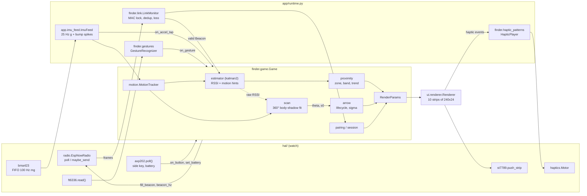

# Architecture

How the code is layered, what happens on each tick, and how fast things run.
Behaviour is defined in [`design/ui-spec.md`](design/ui-spec.md); the drivers
are described in [`../hal/README.md`](../hal/README.md).

## Layers

| Layer | Where | Runs on | Depends on |
|---|---|---|---|
| Hardware abstraction | `hal/` | watch (and CPython/WASM against `tests/fakes/`) | `machine`, `network`, `espnow`, `framebuf` |
| Game logic | `finder/` | watch, CPython, browser (MicroPython WASM) | nothing hardware-specific; `finder/compat.py` only |
| Renderer | `ui/` | watch, browser (needs `framebuf`, so MicroPython only) | `finder.render_params`, `finder.tuning` |
| Watch runtime | `app/`, `main.py`, `boot.py` | watch (tested on CPython with fakes) | `hal.board.Board`, `finder`, `ui` |
| Simulation | `sim/` (+ `sim/webhost.py`, `web/sim/index.html`) | CPython, browser | `finder`, `ui` (webhost only) |
| Tooling | `tools/`, `tests/` | host (some scripts on the watch) | all of the above |

Rules that keep the layers apart:

- Only `hal/` imports `machine`, `network` or `espnow`. `app/runtime.py`
  receives hardware through `Board` parts and even copies the few `hal` constants
  it needs, so it runs against fakes.
- `finder/` never reads hardware or the clock by itself: every call takes a
  `t_ms` (ticks ms, compared only with `ticks_diff`). That is what lets one fake
  clock drive two games in the simulator and in `tests/test_episode.py`.
- The renderer reads **only** `RenderParams` (plus `game.runes`,
  `game.menu_rows`, `game.sun`). It never sees estimator internals. The same
  `RenderParams` stream can be logged as JSON and replayed.
- Constants come from `docs/design/tokens.json` through `tools/gen_tuning.py`
  into `finder/tuning.py`, which the logic and the renderer share.

## Data flow per tick

One `Runtime.step(now)` (see the docstring in `app/runtime.py`) runs these
stages in order:

1. **radio**: `radio.poll()` drains ESP-NOW (at most 32 frames). Each frame goes
   through `LinkMonitor.on_packet` (locked to `game.pair.peer_mac`; bad and
   duplicate frames dropped), is unpacked into a `proto.Beacon` and passed to
   `game.on_packet(t_rx, mac, rssi, beacon)`. The game updates the partner view,
   feeds pairing/calibration, calls `est.update(t, rssi, peer_rssi, my_motion,
   peer_motion)` and, while scanning, `scan.on_packet` with the raw RSSI.
2. **imu**: `ImuFeed.poll` drains the BMA423 FIFO, block-averages to 25 Hz for
   `MotionTracker.add_sample` (steps, activity, stillness, tilt, face-up) and
   runs the bump spike detector on every 100 Hz sample (-> `game.on_accel_tap`),
   ignoring samples inside haptic blanking. Once a second the optional feature
   engine adds chip steps and activity, and wrist-wear -> `game.on_wake`.
3. **touch**: `FT6336.read()` -> `GestureRecognizer` -> `game.on_gesture`.
4. **button**: `AXP202.poll()` -> `game.on_button(t, long)`.
5. **logic** (every 100 ms): `game.set_tracker`, battery every 10 s, then
   `game.tick(t)`. Inside `tick`: the delivery meter and `Proximity.update_est`
   turn the estimate into zone (with hysteresis and dwell), intensity, band and
   gated trend; the active mode runs (`pairing`, hunt with `arrow`, `scan`,
   link-lost, found, menu); FOUND is checked from the bump match; the result is
   one `RenderParams`. The runtime then applies screen power and backlight, and
   shuts the PMU down only once `game.power_off`.
6. **render** (at `params.fps_cap`): `Renderer.frame(params, display, now)`
   composes each 240x24 strip off-screen (GS8 ring-index map blitted through a
   256-entry byte-swapped RGB565 palette, then glyph and text overlays) and
   pushes it with `display.push_strip`. With the screen off it runs with
   `display=None`, so ring and heartbeat timing continue. It returns haptic
   events (heartbeats locked to ring spawns, plus `params.haptic` once).
7. **tx**: when due, `game.fill_beacon` fills the 16-byte beacon (seq, own and
   filtered RSSI of the partner, steps, activity, battery, state byte, flags,
   bump age) and `radio.maybe_send` broadcasts it. The period is
   `1000 // game.beacon_hz` with about 10 % jitter from `TxScheduler`, so two
   watches never transmit in lock-step.
8. **haptic**: renderer events go into `HapticPlayer.play_frame`; `tick(now)`
   gives the motor level, applied by `Motor.set` only on change. The motor is
   also serviced after every strip, and in `idle` while a pattern plays.
9. **gc**: `gc.collect()` once a second when the next frame is at least 10 ms
   away (forced after 4 s).

`step` returns the ms to the next deadline; `run` sleeps that long (at most
50 ms). I2C errors are counted in `io_errors` and never stop the loop.

### Direction (scan -> arrow)

The player holds the watch flat at the chest and turns on the spot for 12 s of
active time, guided by a wedge that turns at 30°/s. The body shadows the signal,
so RSSI (own, and the partner's reported `rssi_last`) is lowest facing away.
`ScanSession` tags each raw sample with the wedge angle φ and fits
`rssi = a0 + a1·cos(φ − θ)`. A good fit gives an arrow at θ with a cone s0.
A weak or noisy fit is an honest `NO FIX`. Tilt or walking pauses the sweep. The
arrow is relative to the heading at scan start, and `arrow.py` grows its sigma
with steps and time until it expires.

### FOUND

`Game` never enters FOUND from RSSI. Each beacon carries `bump_ago_ms`, so the
receiver puts the partner's accelerometer spike on its own clock (the unknown
clock offset cancels). Both spikes within 400 ms while both watches are in HOT
is a match. The fallback is both short presses within 3 s in HOT.

## Timing

| What | Rate | Where |
|---|---|---|
| Game logic (`Game.tick`) | 10 Hz (100 ms) | `app.runtime.TICK_MS` |
| Render | 20 fps (15 in saver / low battery); a frame is about 40 ms on the watch, about 35 ms of it SPI at 26.67 MHz | `params.fps_cap`, `tuning.FPS_*` |
| Beacons | 10 Hz normal, 20 Hz in HOT and while scanning, 5 Hz in saver | `game.beacon_hz`, `tuning.BEACON_HZ_*` |
| BMA423 FIFO | 100 Hz, drained every loop (holds 1.7 s) | `app.imu_feed` |
| Motion tracker | 25 Hz | `app.runtime.IMU_OUT_HZ` |
| Feature engine poll | 1 Hz | `app.runtime.CHIP_MS` |
| Touch / button poll | every loop, at least every 20 ms | `app.runtime.INPUT_MS` |
| Battery | every 10 s; a shutdown-level reading must repeat 3 times, 1 s apart, off USB | `BATTERY_MS`, `BATT_LOW_READS` |
| Haptics | pulses and gaps >= 60 ms; motor serviced every strip and every 1 ms while a pattern plays | `finder.haptic_patterns` |
| Link loss | 5 s with no packet after a fix -> LINK_LOST | `finder.game`, ui-spec §6 |

Budgets: an estimator update should stay well under 2 ms on the ESP32
(kalman2 is about 30 µs per packet on the WebAssembly port). The render loop
allocates nothing, so gc stays short and predictable.

## Simulation and the web simulator

`sim/` models two walkers (`world.py`), per-packet RSSI with path loss,
shadowing, fading, body blocking and obstacles in four profiles
(`radio.py`: clean, typical, harsh, indoor), and BMA423-like step and activity
hints with realistic errors (`imu.py`). `sim/accel_synth.py` makes raw wrist
accelerometer data for the drift study. `Sim` binds them; `scenarios.py` names
repeatable runs.

- `tools/bakeoff.py` replays the same traces into every estimator.
- `tests/test_episode.py` wires two full `Game`s to the sim, with beacons packed
  and unpacked through `finder.proto`, and plays a round to FOUND.
- `sim/webhost.py` (`TwoWatchSim`) does the same with a `Renderer` +
  `FrameCapture` per watch. `web/sim/index.html` loads MicroPython WebAssembly,
  steps it from `requestAnimationFrame` and blits both 240x240 frames straight
  from wasm memory. `tools/build_sim.py` bundles `finder/`, `ui/` and `sim/` into
  `dist/sim/`.

The browser therefore runs the same state machine, constants and renderer as the
watch. Only the drivers, the runtime loop and the physics differ.
