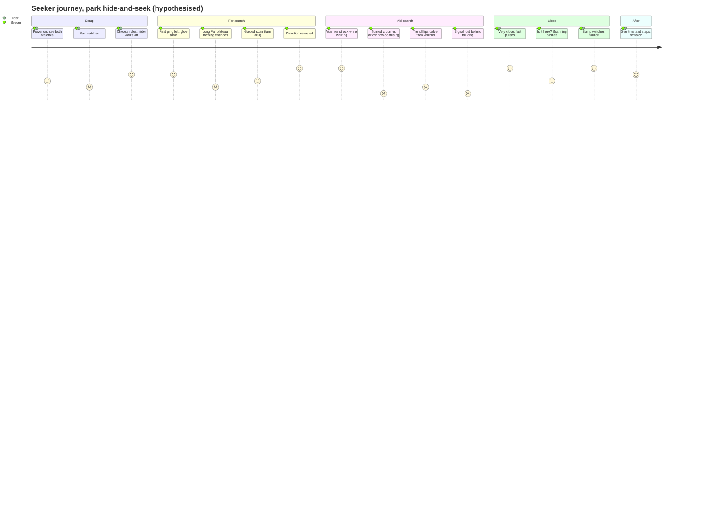

# Watch Game: User Research Package

**Status:** v0.1 plan written 2026-09-26, before any user sessions have run.
**Scope:** 2-player "find each other" game on two LILYGO T-Watch 2020 units. It uses RSSI proximity, guided direction maneuvers, a ripple UI rendered by palette cycling, and haptics.
**Evidence level:** Everything below is a **hypothesis** until one of the studies in §4 confirms or rejects it. The only numbers in this document are (a) arithmetic derived from the hardware, such as pixel-to-mm conversion, or (b) *proposed starting values* that are labelled as such and meant to be tuned. Nothing here is measured user data.

Display math used throughout: a 1.54" diagonal square has a 27.7 mm side, so 240 px / 27.7 mm ≈ **8.7 px/mm (≈220 ppi)**. That makes 24 px ≈ 2.8 mm, 64 px ≈ 7.4 mm, 80 px ≈ 9.2 mm and 120 px ≈ 13.8 mm.

### Glossary

| Term | Meaning in this doc |
|---|---|
| **Beacon** | Periodic radio packet (BLE advert or ESP-NOW frame) carrying `pair_id`, `seq`, battery %, and game state |
| **RSSI / filtered distance** | Raw received signal strength and its smoothed estimate converted to metres. It is noisy, so treat it as roughly ±30-50% |
| **Zone** | A discrete proximity band shown to the player (e.g. Far / Near / Close / Very close / Here) |
| **Trend** | Warmer (+1), steady (0) or colder (−1), computed from the filtered distance while the player is moving |
| **Scan** | A guided 360° turn with the watch held at the chest. The RSSI peak gives a bearing relative to the heading at scan start |
| **Probe** | Gradient maneuver: walk N steps, turn 90°, walk N steps, then compare the RSSI change on each leg |
| **Bearing confidence** | How much the direction estimate can still be trusted. It decays with steps taken, time elapsed and suspected turns |

### Research rounds (lean plan)

| Round | Who | Where | Purpose | Est. effort |
|---|---|---|---|---|
| **R0 Bench** | Builder alone, 2 watches | Hallway + open field | Characterise RSSI vs distance, walking noise and body-shadow strength during a scan. This is a precondition for A1 and A4 | 2-3 short sessions |
| **R1 Desk sim** | 3-5 friends, 15 min each | Desk, **web 2-watch simulator** (top view, drag and rotate the watches) | Comprehension of zones, trend and arrow-after-turn with no radio noise confound | 1 evening |
| **R2 Field pilot** | Builder + 1 friend | Park | Dry-run of the protocol, logging and ground-truth capture | 1 session |
| **R3 Field study** | 3-4 friend pairs, with roles swapped | Open park + mixed park/buildings + 1 indoor | Main usability test (§4) | 3-4 sessions × 60 min |
| **R4 Context probes** | 1-2 parent+kid pairs; 1 festival/crowd outing | Playground; event | Check the non-game jobs (JTBD J5, J6) and kid-specific issues | Opportunistic |

---

## 1. Research questions & riskiest assumptions

### 1.1 Research questions

| # | Question | Main method |
|---|---|---|
| RQ1 | Can players get *useful* proximity information in a **1-2 s glance** while walking, including in bright sun? | T2 glance test, observation |
| RQ2 | Can players **distinguish haptic proximity levels** through the wrist while walking, with no screen? | T3 haptic-only walk |
| RQ3 | Do players **trust** warmer/colder given RSSI noise? What flip-flop rate makes them stop believing it? | T5 hunt + log analysis + interview |
| RQ4 | Can players **physically execute** the guided 360° scan at the pace the firmware assumes? Does the result point the right way? | T4 scan task with chest-phone heading ground truth |
| RQ5 | After a scan, do players **correctly interpret the arrow once they have turned or walked**, given that there is no compass? | T6 point-to-partner task |
| RQ6 | Which direction aid gets people to the partner faster and with fewer wrong turns: persistent relative arrow, "face-and-go", or the step probe? | Within-subject A/B in T5 |
| RQ7 | What makes a satisfying and *unambiguous* **"found"** moment? | T7 + interview |
| RQ8 | What does the **hider** do and feel? Does hider movement break the seeker's trend? | Role swap, logs (hider `activity`) |
| RQ9 | Does a 30-min session fit the **380 mAh** battery with realistic screen-on and haptic use? | Telemetry (battery_mv over time per UI mode) |
| RQ10 | Are the non-game jobs (festival regroup, kids' hide-and-seek) real, and do they change the requirements, e.g. around over-trust in safety? | R4 probes, interviews |

### 1.2 Assumption map (riskiest first)

Risk = impact if wrong × current uncertainty. H = high, M = medium, L = low.

| ID | Assumption | Impact if wrong | Uncertainty | Risk | Test (where) | Proposed decision rule (set **before** R3 to avoid moving goalposts) |
|---|---|---|---|---|---|---|
| **A1** | Players can follow a guided 360° turn at a steady pace with the watch held at the chest, **and** body shadowing makes a detectable RSSI peak in the partner's direction | Direction feature fails; game falls back to hot/cold only | H (behaviour and physics both unproven) | **H×H** | R0 bench (physics), T4 (behaviour) | If most R3 scans land outside ±45° of the true bearing, **do not ship a precise arrow**. Show a quadrant/half-plane wedge or rely on the probe instead |
| **A2** | After a scan, players understand that the arrow is relative to their scan-start heading and **stays valid only until they turn** | Players follow a stale arrow the wrong way, and trust in the whole game collapses | H | **H×H** | R1 sim, T6 | If point-to-partner error after a 90° turn is typically worse than before the turn, replace the persistent arrow with the "face-and-go" flow (R-04) |
| **A3** | RSSI trend (warmer/colder) is stable enough that players **believe** it | Players ignore the core feedback, and the game feels random | H | **H×H** | R0 (noise while walking), T5 logs, trust rating | If players report distrust or the log shows frequent reversals while walking a straight line, raise the hysteresis and show "steady" more often rather than flipping |
| **A4** | Players can distinguish **3-4 haptic cadence levels** while walking | The haptic channel cannot carry proximity, so players must stare at the screen | M-H | **H×M** | T3 | If adjacent levels are confused, collapse to fewer levels and rely on *change* in cadence rather than absolute level |
| **A5** | A green glow with brightness rising with proximity is **readable in sunlight**, including the dim Far zone | Far-zone players see "nothing" and assume the watch is broken | M | **H×M** | T2 in sun vs shade | If Far is unreadable in sun, encode proximity by motion/ring count with a bright minimum rather than by brightness alone (R-02) |
| **A6** | Discrete **zones** communicate better than metres | False precision drives wrong decisions | M | M×M | R1, T2, interview | If players ask for numbers, test a coarse "~20 m" label in R3 variant B |
| **A7** | Only the seeker moves (or both moving is fine) | Hider movement makes the seeker's trend meaningless | M | M×M | Role logs (`activity` of both) | If hider movement correlates with seeker wrong turns, add a "stay still" nudge on the hider watch |
| **A8** | Pairing two watches takes one simple action and never pairs with a stranger's watch | Friction at the very first moment, or cross-talk if 2+ pairs play | L-M | M×L | T1 | If any T1 participant needs help, redesign pairing |
| **A9** | A 30-min session fits the battery at ~20-30 fps rendering, radio and haptics | Game dies mid-hunt, with a large emotional low | M | M×M | Telemetry `batt_mv` per mode | If the projected drain exceeds budget, add a haptic-first low-power mode with the screen off between glances |
| **A10** | "Found" can be decided from RSSI alone | False "found" through a wall or floor, or no closure when 2 m apart | M | M×M | T7 | Require a physical confirm such as a watch-to-watch bump detected by BMA423 tap detection |
| **A11** | Wrist-tilt wake works while walking and doesn't false-wake too often | Players miss glances or drain battery | M | M×L | Log `tilt_wake` vs `screen_on`, observation | Tune the tilt threshold; allow the side button as a fallback wake |
| **A12** | The TotK-style ripple aesthetic *adds* motivation and doesn't just look nice | Effort spent on polish that doesn't change play | L | L×M | Interview reaction, would-play-again | Informs the polish budget only |
| **A13** | Step count + activity (still/walk/run) is a good enough proxy for "you have moved" to decay bearing confidence. Double-integrating the accelerometer, as tried in `notebooks/watch movement.ipynb`, drifts within seconds without a gyro or reference and cannot be used | Stale direction shown as confident | M | M×M | T6 logs (`steps_since_scan` vs pointing error) | Tune the decay constants from data |
| **A14** | Indoors or near buildings, multipath makes RSSI occasionally *mislead* (e.g. stronger through a doorway) and players forgive it if warned | Unexplained failures break trust | M | M×M | Indoor session in R3 | Add a "signal unreliable here" state when variance is high |

**Top 5 to de-risk first:** A1, A2, A3, A4, A5. R0 and R1 can partially de-risk A1-A3 and A6 **before** any field session.

---

## 2. Proto-personas and Jobs-to-be-Done

These are **proto-personas**: assumption-based sketches built from the brief and the builder's context, and not yet validated. Revisit them after R3.

### P1: "The Builder" (hobbyist developer, primary tester)
- **Who:** Built the firmware and knows how RSSI works. Plays mostly to verify that the system works. Carries a laptop to debug.
- **Wants:** To see *why* the watch shows what it shows (raw RSSI, filtered distance, zone, scan curve), and to tweak constants quickly.
- **Tolerates:** Calibration steps, jargon, reboots.
- **Risk to the design:** Designs for himself. Numbers and debug text leak into the player UI, and the scan gets "easy" because he knows the pace.
- **Needs from UX:** A hidden debug overlay, logs, and replay in the web simulator. The default player UI stays clean.

### P2: "The Casual Seeker" (friend handed a watch)
- **Who:** Adult friend who may know Zelda: TotK. Gets a 30-second explanation and plays 1-3 rounds.
- **Wants:** Fun tension, the feeling of "I'm getting it", and a clear win.
- **Context:** Walking in a park, phone in pocket, glancing at the wrist, sometimes in full sun. One hand is often busy with a drink or bag.
- **Frustrations (hypothesised):** Doesn't know if the watch is working. Direction feels random. Having to read small text. Being told to "calibrate".
- **Needs from UX:** Readable without training. Haptics carry most of the info. One button for "help me find direction".

### P3: "The Parent + Kid" (kids' hide-and-seek; secondary: festival regroup)
- **Who:** A parent with a 6-11-year-old. The kid wears the watch, which is large on a small wrist. They run rather than walk.
- **Kid wants:** Buzzes, glow, a "you found me!" moment. The kid may not read.
- **Parent wants:** A fun game. Implicitly also "I can find my kid", which is a **dangerous over-trust risk** because RSSI is not a safety system.
- **Needs from UX:** A text-free mode. Big, bright, haptic-first. Explicit framing that this is not a tracker. Simple roles.

### Jobs-to-be-Done

| # | Job statement | Type | Persona | Implication |
|---|---|---|---|---|
| J1 | *When my friend is hiding somewhere in the park, I want a hot/cold sense I can trust while walking, so the hunt feels like skill rather than luck.* | Functional + emotional | P2 | Stable trend and honest uncertainty (R-03) |
| J2 | *When I'm stuck and nothing is changing, I want a way to get a direction, so I can make progress instead of wandering.* | Functional | P2, P3 | Scan/probe as an explicit "help" action (R-05, R-06) |
| J3 | *When I'm the one hiding, I want to feel the seeker getting closer, so the waiting is tense and fun rather than boring.* | Emotional | P2, P3 kid | Hider screen shows the approach (R-13) |
| J4 | *When we meet, I want an unmistakable "found" moment and my time, so we want a rematch.* | Emotional + social | All | Bump-to-confirm plus a result screen (R-10) |
| J5 | *When we get separated at a festival and phones are useless, I want a rough "you're close / which way", so we can regroup without shouting.* | Functional (non-game) | P2 | Symmetric "regroup" mode; both move (R-13) |
| J6 | *When my kid is playing in the park, I want to know roughly where they are.* | Functional (non-game) | P3 parent | **Must be explicitly declined as a safety feature.** Best-effort "out of range" buzz only, clearly labelled (R-13) |
| J7 | *When the watch behaves oddly, I want to see the raw numbers and replay what happened, so I can fix the firmware.* | Functional | P1 | Telemetry and replay in the web simulator (R-14) |

---

## 3. Key scenarios and journey map

### 3.1 Scenarios

| # | Scenario | Distance | Environment risks | What it stresses |
|---|---|---|---|---|
| S1 | **Park hide-and-seek**: 2 friends; the hider picks a spot 50-100 m away | 5-100 m | Trees and the hider's own body shadow the signal; sun glare | Full loop: far plateau → scan → trend → found |
| S2 | **Indoor / house**: hide in another room or floor | 3-20 m | Walls, multipath, different floors ("strong but unreachable") | Found ambiguity, misleading trend (A10, A14) |
| S3 | **Festival regroup**: separated in a crowd, both moving | 10-80 m | Many bodies attenuate 2.4 GHz; noise; both players moving | Symmetric mode, trend confound (A7), glanceability |
| S4 | **Kids' game**: parent seeks the kid, or the kid seeks the parent | 5-50 m | Running, small wrist, no reading, excitement | Text-free UI, haptics, "not a tracker" framing |
| S5 | **Builder debug**: one watch on a tripod, one walked around | 1-100 m | n/a | Debug overlay, logging, replay |

### 3.2 Journey map: seeker in S1 (hypothesised)

Emotion is a hypothesis scored from 1 (very negative) to 5 (very positive). Validate it with the post-session emotion-curve exercise (§4.5).



| Stage | Seeker is doing | Watch shows / feels | Thinking / feeling | Failure moments | Design opportunity |
|---|---|---|---|---|---|
| **1. Power on & pair** | Holds side button on both watches | Pairing code (2 shapes + colour) on both | "Did it work? Is it paired with *hers*?" | Pairs with the wrong watch; no feedback; screen times out mid-pairing | Same glyph pair on both screens plus a buzz. Beacons carry `pair_id` (R-11) |
| **2. Roles & split** | Hider walks away; seeker waits (e.g. a 30 s countdown) | Countdown ring; hider screen says "Hide! Stay still when hidden" | Anticipation | Hider keeps moving, which confounds the trend (A7) | "Stay still" nudge when hider `activity=walk` after the countdown (R-13) |
| **3. Far search** | Starts walking in a guessed direction | Slow, dim-but-visible ripples; a soft buzz every few seconds as a heartbeat | "Is it even working?" (**low**) | Far looks the same as Lost; nothing changes for minutes | Distinct Far vs Lost states; a heartbeat buzz shows the link is alive (R-01, R-09) |
| **4. Ask for direction** | Presses side button → scan | Pose check → 3-2-1 → rotating wedge sweep plus a haptic tick every 45° | "Am I turning too fast? Where do I hold it?" | Turns at the wrong pace, walks during the scan, holds the watch at the side (no body shadow) | Pose check, pace ticks, auto-abort on steps, honest "no clear direction" (R-05) |
| **5. Direction reveal** | Stops, looks | Result: "at your 4 o'clock" → turn-to-face guide → "Walk ↑" | **High:** "magic!" | Weak peak shown as a confident arrow | Wedge width = uncertainty; refuse to show an arrow when the peak is weak (R-04, R-05) |
| **6. Follow & trend** | Walks, glances every 10-30 s | Ripple speed and brightness rise; "warmer" glyph; buzz cadence speeds up | **High** during a warmer streak | Trend flip-flops; after turning a corner the old arrow points the wrong way (**lowest**) | Hysteresis and a "steady" state (R-03); arrow decays with steps and becomes hollow → "rescan?" (R-04) |
| **7. Lost signal** | Behind a building or crowd | Grey frozen state, "lost 12 s", last known state, distinct double-long buzz | Anxiety: "did they leave? is it broken?" | Lost is indistinguishable from Far; no recovery hint | Explicit Lost state + "go back to where it was warmer" (R-09) |
| **8. Close** | Looks around physically | Fast pulses, bright full glow, "Very close" | Excitement; eyes off the watch | RSSI saturates below ~2-5 m, so there is no gradient in the last metres; another floor or wall looks "Here" | Switch to "look around!" and haptics only; prompt the bump (R-10) |
| **9. Found** | Bumps watches | Full-screen bloom, long buzz on both, time + steps | **Peak high** | No closure (RSSI-only found); false found through a wall | Bump-to-confirm on both watches (R-10) |
| **10. After / battery** | Rematch or stop | Result, battery of both watches | "Again!" or "Battery died mid-game" (**low**) | Battery dies silently; partner never knows | Partner battery in the beacon; low-battery warnings on both (R-12) |

### 3.3 Failure moments to design and test explicitly

| ID | Failure | Trigger (from telemetry) | What the player must understand | Test |
|---|---|---|---|---|
| F1 | **Lost signal** | No beacon for > T_lost (proposed start: 5 s) | "Link lost. This is not 'far'. Here's the last known state and what to do" | T6b: hider steps behind a building |
| F2 | **Wrong way** | Trend = −1 sustained while walking | "You're getting colder. Turn around or scan", said gently with no alarm | T5 observation |
| F3 | **Battery low** (own or partner's) | `batt_pct` ≤ 20 / 10; partner's via beacon | "Partner's watch is low. Hurry or end the game" | Force it by starting a session at low charge (R2) |
| F4 | **Confusing arrow after turning** | `steps_since_scan` > N or suspected turn | "The arrow is old. Rescan" | T6 point-to-partner |
| F5 | **Scan failed / aborted** | Steps during scan; pose lost; weak peak | "No clear direction. Try again or walk 20 steps first" | T4 |
| F6 | **Flip-flop / multipath** | High RSSI variance | "Signal is jumpy here; move a few steps" | Indoor session |
| F7 | **False found / other floor** | Zone = Here but no bump | "Very close. Look around, maybe upstairs or behind a wall" | S2 indoor |
| F8 | **Missed glance** | `tilt_wake` absent while the wrist was raised | Screen should be on when looked at | Observation + logs |

---

## 4. Field usability-test plan (2-player sessions)

### 4.1 Goals
1. Measure whether players can find each other using the watch alone, and where they fail (RQ1-RQ7).
2. Validate or invalidate assumptions A1-A5 against the decision rules in §1.2.
3. Collect aligned telemetry from both watches plus ground truth so that every UI moment can be replayed in the web simulator.

### 4.2 Participants and roles
- **Pairs:** 3-4 friend pairs in R3, plus 1-2 parent+kid pairs in R4. Each pair plays both roles. Include at least one person who wears their watch on the **right** wrist, because the scan posture differs, and at least one person unfamiliar with Zelda.
- **Facilitator:** Ideally not the builder, because friends are polite to the person who built the thing. If the builder facilitates, stick to the script and rely on behavioural metrics more than opinions.
- **Observer (optional but useful):** Walks ~5 m behind the seeker with a timestamped note sheet.
- **Consent:** Verbal consent for notes, logs and optional video of the wrist. Kids take part only with a parent present and the parent's consent. Stay within a boundary with no roads.

### 4.3 Setup and ground truth
- Charge both watches to full. Label them **A** and **B**. Flash the same firmware build and note `fw_version` and the `ui_variant` under test.
- **Hide spots:** Before the session, choose 4-6 spots at a range of distances (e.g. roughly 20 / 50 / 80 m) from a start marker. Record each distance and bearing from the start by pacing or tape and a map/compass. The hider draws a spot card.
- **Heading ground truth for scans:** Strap a phone to the seeker's chest running a sensor-logging app (magnetometer heading + accelerometer). Start with a **"triple clap"**, a sharp tap that shows as a spike in both the phone's and the watch's accelerometer logs, and align clocks with it.
- **Position ground truth (optional):** A GPS track on each player's phone. It is only accurate to a few metres in open sky and worse near buildings, so use it for path shape and wrong-turn detection, not for fine distance.
- **Cross-watch time alignment:** Each watch logs the `seq` of beacons it sends and the `peer_seq` of beacons it receives. Aligning on `seq` syncs A and B logs without a shared clock.

### 4.4 Session protocol (≈60 min)

| Time | Block | Script / instructions | Captures |
|---|---|---|---|
| 0-5 | Intro & consent | "We're testing the watches, not you. Anything confusing is the watch's fault." | Consent |
| 5-8 | **T1 Pair** | Hand over both watches powered off. "Get these two watches talking to each other." No help for 2 min. | Time, errors, hesitations, where they looked |
| 8-10 | Standard briefing | **Fixed 30-second script** (same for everyone): what glow, buzz and arrow mean; the side button asks for direction. Nothing more. | n/a |
| 10-17 | **T2 Glance test** (static) | Partner stands at 3 known distances (near/mid/far, in random order), in sun and shade. The seeker keeps the wrist down, raises it for ~2 s on the cue "look", lowers it, then says "how close?" and "warmer or colder?" | Correct zone named; response time; sun vs shade |
| 17-24 | **T3 Haptic-only walk** | Screen covered with tape or disabled. The partner stands still. The seeker walks a straight line toward and then away from the partner (the facilitator picks the order) and says "closer" or "farther" whenever they notice a change. Repeat with haptic scheme B if testing. | Latency and correctness of calls vs ground truth |
| 24-32 | **T4 Guided scan** | At the start marker, the hider is at a known spot. "Use the watch to find out which way she is." Repeat 2-3 times from different start headings. | Completion, abort reason, scan bearing vs true bearing, pace adherence (chest phone) |
| 32-45 | **T5 Full hunt** | The hider draws a spot card and walks there during a 60 s countdown. "Find her. Use anything the watch gives you." Max 10 min. Swap roles and use variant B of the direction aid (persistent arrow vs face-and-go). | Time-to-find, path, wrong turns, scans, glances, quotes |
| (in T5) | **T6 Point-to-partner** | Twice during the hunt the observer says "point!". The seeker points with their arm; the observer reads the arm bearing with a compass app. (T6b: the hider steps behind a building once to force Lost.) | Pointing error vs `steps_since_scan`; Lost recovery |
| (end T5) | **T7 Found** | No instruction. Observe what they do when close. | Found confirmation success; false found |
| 45-58 | Interview (§4.6) | With log replay in the web simulator if a laptop is on site | Quotes, trust, fun, emotion curve |
| 58-60 | Wrap-up | Thanks | n/a |

**Counterbalancing:** Alternate which variant (A/B) each pair sees first and which person seeks first. Hide spots are drawn randomly without replacement.

### 4.5 What the watches log (telemetry)

**Format:** JSON Lines on flash, one file per session (`/log/<session_id>_<device>.jsonl`). Write in buffered chunks (e.g. every ~2 s) to limit flash wear and frame drops. Budget check: a ~120-byte record at 5 Hz is ~600 B/s, which is ~36 KB/min or ~1.1 MB per 30 min. Check free space with `os.statvfs` before each session and drop to 2 Hz if space is short.

**A. Periodic state record (`"ev":"s"`, 5 Hz)**

| Field | Type | Source | Why |
|---|---|---|---|
| `t` | int ms | `time.ticks_ms()` since boot | Timeline |
| `sid`, `dev`, `role` | str | config | Session, A/B, seeker/hider |
| `fw`, `uiv` | str | build | Firmware and UI variant under test |
| `rssi` | int dBm | last beacon | Raw signal |
| `rssi_f` | float dBm | filter | Filter behaviour |
| `d_est`, `d_lo`, `d_hi` | float m | model | Estimate and its uncertainty band |
| `zone` | int 0-4 | UI logic | What the player saw |
| `trend`, `trend_c` | int −1/0/+1, float 0-1 | UI logic | Trend and its confidence |
| `lost_s` | float s | since last beacon | Link health |
| `steps` | int | BMA423 step counter (cumulative) | Movement |
| `act` | enum still/walk/run | BMA423 activity | Movement state; hider stillness |
| `steps_since_scan` | int | derived | Arrow decay input |
| `arrow_deg`, `arrow_c` | int deg / null, float | UI | What direction was shown and how confidently |
| `ui` | enum | state machine | pair/countdown/search/scan/probe/lost/close/found/lowbatt |
| `scr` | bool | backlight | Screen on (glance proxy) |
| `bl` | int 0-100 | backlight | Brightness level |
| `fps` | int | render loop | Performance vs spec |
| `batt_pct`, `batt_mv`, `chg` | int, int, bool | AXP202 | Battery drain per mode |
| `p_batt` | int | partner beacon | Partner battery |

**B. Event records**

| `ev` | Fields | Notes |
|---|---|---|
| `bcn_rx` | `peer_seq`, `rssi`, `ch` | Every received beacon. Gives loss rate and cross-device sync; the channel matters for BLE adverts |
| `bcn_tx` | `seq` | Every sent beacon |
| `haptic` | `pattern` (id), `dur_ms` | Which buzz fired |
| `tilt_wake`, `tap`, `dtap` | n/a | BMA423 interrupts |
| `btn` | `kind` short/long | Side button (AXP202 IRQ) |
| `touch` | `x`, `y`, `target` | Touch hits and misses (missed targets = target size issue) |
| `scan_start` | `pose_ok`, `az_g` | Pose check result |
| `scan_sample` | `k`, `deg_assumed`, `rssi` | Per sample, assumed angle from timing |
| `scan_end` | `ok`, `abort` (steps/pose/timeout/user), `dur_ms`, `peak_deg`, `prom_db` (peak minus median), `width_deg`, `conf` | Scan quality |
| `probe_start` / `probe_leg` / `probe_end` | `leg`, `steps`, `d_rssi`, `result` (quadrant) | Gradient maneuver |
| `found_prompt`, `found_ok` | `method` (bump/tap/button), `rssi` | Found confirmation |
| `mark` | `note_id` | Facilitator marker (e.g. long-press when "point!" is called) |
| `clap` | n/a | Sync spike |

**C. Manual observer sheet (per session):** timestamp · stage · what happened · quote · severity 0-4. Also mark every stop longer than 5 s, every visible "which way?" gesture, and every time they look at the watch for more than 3 s ("stare").

### 4.6 Metrics (operational definitions)

| Metric | Definition | Source | Used for |
|---|---|---|---|
| **Time-to-find** | `countdown_end` → `found_ok` (s). Also report time to first zone ≥ Close | Log | Overall effectiveness, variant comparison |
| **Path efficiency** | Straight-line start→hide distance ÷ distance walked (steps × stride estimate from the participant's height, or GPS track) | Log + GPS | Wrong-turn cost |
| **Wrong turns** | Count of segments with ≥ 10 steps where true distance **increased** (from GPS or observer notes). Classify each as *UI-caused* (the UI said warmer or the arrow pointed that way) or *user-caused* (the UI said colder or showed nothing) | GPS/observer + log | Separates UI faults from player choice |
| **Scan completion rate** | `scan_end.ok` ÷ `scan_start` | Log | A1 behaviour |
| **Scan accuracy** | Share of completed scans with \|`peak_deg` − true relative bearing\| ≤ 45°. The true relative bearing = map bearing to the hide spot − chest-phone heading at `scan_start` | Log + chest phone + map | A1 physics + behaviour |
| **Scan pace adherence** | Chest-phone turn rate vs the guide's rate across the scan (deviation in °/s, and where it peaks) | Chest phone | Why scans fail |
| **Point-to-partner error** | \|pointed bearing − true bearing\|, plotted against `steps_since_scan` and time since scan | T6 + map | A2, decay tuning |
| **Trend correctness** | Over 10 s windows while `act=walk` and the true distance changed by > 3 m: share where the displayed `trend` sign matches | Log + GPS | A3 |
| **Trend reversal rate** | Displayed trend sign changes per minute while walking | Log | A3 flip-flop |
| **Haptic discrimination** | T3: share of correct "closer/farther" calls; latency from zone change to call | T3 | A4 |
| **Glance accuracy** | T2: share of correct zone and trend answers, split by sun vs shade | T2 | A5, A6 |
| **Glance count / stare count** | `scr` on-periods per minute; periods > 3 s | Log + observer | Is it glanceable? |
| **Lost recovery time** | `lost` entered → next beacon (s); what the player did | Log + observer | F1 |
| **Found confirmation** | `found_ok` success; false "Here" without a partner in sight | Log + observer | A10 |
| **Battery drain** | Δ`batt_mv` per 10 min, split by `ui` and backlight level | Log | A9 |
| **Subjective (1-7 SEQ per task; 1-5 trust, fun, would-play-again)** | Asked right after each task / session | Interview | Triangulation |

**Analysis stance:** With 3-4 pairs, report per-session values and medians and look for consistent patterns. Don't compute p-values. A metric that fails its decision rule (§1.2) in most sessions is a design problem, not noise.

### 4.7 Interview guide (≈13 min, right after the hunt)

Do this **on site**, while memory is fresh. If a laptop is available, replay the seeker's log in the web simulator and ask the participant to narrate it (retrospective think-aloud).

**Warm-up (1-2 min)**
- "How did that feel, in one word?"
- "Have you played anything like this before, like hide-and-seek or geocaching? Does Zelda ring a bell?"

**Context (2-3 min)**
- "When have you last had to find a friend somewhere: a festival, a park, a shop? What did you do?"
- "When do you look at your watch or phone while walking? What makes you keep looking?"

**Deep dive (5-6 min)**, walking through the replay or their memory stage by stage:
- "At the start, before anything changed, what did you think the watch was telling you?" *(Probe: did you think it was working?)*
- "Tell me about the moment you pressed the button to find a direction. What were you trying to do with your body?" *(Probe: pace, where you held it, what you looked at.)*
- "After the arrow appeared, you turned here [point to replay]. What did the arrow mean to you then?" *(Don't correct them. Note their mental model.)*
- "Were there moments you didn't believe the watch? What made you stop believing it, and what brought you back?"
- "What did the buzzing tell you? Could you tell what it meant without looking?"
- *(Hider)* "What was it like waiting? What did you want to know?"
- "How did you know you'd found them?"

**Reaction (3 min)**: show 2-3 alternatives on the web simulator at ~1:1 size (27.7 mm square) or as printed cards:
- Arrow vs wedge (uncertainty sector) vs "face-and-go"
- Zone words vs no words vs a "~20 m" label
- Haptic scheme A vs B (felt on the watch)
- "Which would you rather have mid-hunt? Why?" *(Ask for a choice first, then the reason.)*

**Wrap-up (1-2 min)**
- **Emotion curve:** on a card with the stages from §3.2, the participant draws a line from 1 (awful) to 5 (great).
- "If you could change one thing, what would it be?"
- "Would you play again? With whom, and where?"
- Thank them.

**Kid variant (≤ 5 min):** "What was the best part? The worst part? What did the buzzing mean? Show me with your hands how close you were when it buzzed fast." Use a 3-face smiley scale for fun and difficulty.

### 4.8 Synthesis template

Copy this block into `docs/research/sessions/<date>-<pair>.md` after each session. Then run a cross-session synthesis.

```markdown
## Session <id> — <date>, <location type>, pair <P?>/<P?>, fw <x>, uiv <A/B>
Conditions: weather/sun ____, obstacles ____, start battery A __% B __%

### Metrics
| Task | Seeker | Result | Notes |
|---|---|---|---|
| T1 pair time / errors | | | |
| T2 glance accuracy (sun / shade) | | | |
| T3 haptic calls correct / total | | | |
| T4 scans ok / started; within ±45°? | | | |
| T5 time-to-find; wrong turns (UI / user) | | | |
| T6 pointing errors (steps since scan) | | | |
| T7 found method; false found? | | | |
| Battery Δ over session | | | |
| SEQ / trust / fun / replay | | | |

### Observations (one row per atomic observation)
| # | t | Stage | Source (log / obs / quote) | Observation | Tag | Sev 0-4 |
|---|---|---|---|---|---|---|

Tags: PAIR · GLANCE · SUN · HAPTIC · TREND-TRUST · SCAN-BODY · SCAN-RESULT · ARROW-STALE · LOST · FOUND · BATTERY · HIDER · FUN · KID · SAFETY · PERF
Severity: 0 none · 1 cosmetic · 2 minor delay · 3 major (wrong way / needed help) · 4 blocker (could not find / gave up)

### Top 3 moments (quote + timestamp)
1.
2.
3.

### Emotion curve (participant-drawn): photo link / values per stage
```

**Cross-session synthesis steps**
1. **Affinity map.** Put all observation rows on cards and cluster them by tag, then by emergent theme. Split any theme that mixes a physics cause (RSSI) with a comprehension cause (UI).
2. **Insight statements.** Write each theme as *"We saw [behaviour] in [n of N] sessions, because [cause from log or quote], which means [implication] → requirement R-xx."*
3. **Assumption scoreboard.**

   | ID | Decision rule (§1.2) | Evidence | Verdict (holds / fails / unclear) | Action |
   |---|---|---|---|---|

4. **Impact/effort matrix.** Place candidate changes on impact (severity × frequency) against effort (firmware complexity, and whether it breaks the palette-cycling budget).
5. **Decision log.** Record the date, the decision, the evidence and the next test. Keep it in `docs/research/decisions.md`.
6. **Replay library.** Tag 3-5 representative log segments (best hunt, worst wrong turn, a failed scan, Lost) for regression checks in the web simulator.

### 4.9 The web 2-watch simulator as a research instrument
The planned web simulator (top view of two players and watches; drag to move, rotate to turn; each watch's 240×240 screen updates live) makes the research cheaper:
- **R1 comprehension tests without radio noise:** ask "which way is your partner?" after turning the avatar. This isolates A2 (arrow meaning) from A1 (scan physics).
- **Noise-model tuning:** expose RSSI noise, body-shadow strength and beacon loss as sliders. Tune filter and hysteresis constants until the trend stops flip-flopping in simulation, then confirm in the field.
- **Log replay:** load a session's JSONL pair and scrub the timeline so both screens re-render as the players saw them. This drives the interview (§4.7) and synthesis (§4.8).
- **To be valid as a research tool it must:** run the **same state machine and constants** as the firmware (ideally one shared config file), render the screen at 1:1 physical size on request (27.7 mm), and simulate steps from drag distance so that `steps_since_scan` decay behaves the same.

---

## 5. Design implications: prioritised requirements

P0 = must have before R3 field sessions. P1 = needed for a good game. P2 = later or context modes.
"Render" notes whether the element is **palette** (radial, ~free via ring-index map + palette cycling) or **overlay** (drawn per frame: polygons, rects, bitmap glyphs).

| ID | Pri | Requirement | Derived from | Render | Verify with |
|---|---|---|---|---|---|
| **R-01** | P0 | **Zone-first proximity with redundant encoding.** Show 4-5 discrete zones, each encoded by *all three* of: ripple emission rate (e.g. start at ~1 ripple / 2 s in Far rising to ~3 / s in Here), glow core radius (proposed ~24 px Far → ~100 px Here) and haptic cadence. No metres in the player UI. Zone changes use hysteresis (the filtered value must stay past the boundary for several beacons). | A3, A6, F-noise, J1 | Palette | T2, T5 |
| **R-02** | P0 | **Sunlight-safe minimum: brightness is not the only signal.** Even Far must have a bright ring crest (palette entry at ≥ ~50% of full green) and a bright centre dot (≥ 12 px). Avoid large areas of very dark green, which band in RGB565 and disappear in sun. Use black as the background and a few bright crests rather than dark gradients. Backlight goes to max during a glance. | A5, RGB565 banding | Palette | T2 sun vs shade |
| **R-03** | P0 | **Trend is a separate, conservative channel with a "steady" state.** Show a centre glyph (▲ warmer / ▼ colder, ≥ 24 px ≈ 2.8 mm) plus a palette hue tilt (warmer = yellow-green crests, colder = teal crests). Show a trend only when `act=walk` *and* the change exceeds the noise band; otherwise show "steady" or nothing. Limit reversals (proposed: at most one per ~5 s). When the player stands still, show "walk to sense", because a trend needs movement. | A3, F2, J1 | Overlay glyph + palette hue | T5 trend correctness & reversal rate; trust rating |
| **R-04** | P0 | **Direction as an action, not a persistent compass, and never more precise than the data.** After a scan: (1) state the result relative to the start ("at your 4 o'clock"); (2) run a **turn-to-face** guide using the same angular rate as the scan; (3) show "Walk ↑" with the arrow pointing *up*. The arrow is a filled wedge/chevron ~48-56 px long centred on screen, with a 2 px dark outline for contrast over the glow. **Wedge width = scan uncertainty.** Confidence decays with `steps_since_scan` and time (proposed start: fade over ~60-100 steps). Below threshold it becomes a hollow outline plus "rescan?". A/B test this against the persistent relative arrow. | A1, A2, A13, F4, RQ6 | Overlay polygon | T4, T6 pointing error, T5 A/B |
| **R-05** | P0 | **Guided scan designed around the body.** (a) Pose check from the accelerometer: watch roughly flat at the chest (gravity mostly on the z-axis). Show "hold at chest" until it passes. (b) 3-2-1 countdown with buzzes. (c) A wedge sweeps at a constant rate (proposed start: 360° in 12-20 s; tune in T4) plus a **haptic tick every 45°** so pace can be felt. (d) Auto-abort if steps are counted or the pose is lost ("stand still & turn"). (e) If peak prominence is weak, say "No clear direction. Walk 20 steps and try again" and **show no arrow**. Support left- and right-wrist wearers (mirror the prompt). | A1, F5, J2 | Overlay wedge (1 polygon) | T4 completion, accuracy, pace adherence |
| **R-06** | P0 | **Distinct Lost state, never shown as "Far".** After no beacon for T_lost (proposed 5 s): desaturate the palette to grey, freeze the last known zone and trend, show a "lost 12 s" counter (≥ 16 px glyphs) and play a unique double-long buzz. Give the recovery hint "go back to where it was warmer". Return from Lost with a distinct "reconnected" buzz. | F1, journey stage 7 | Palette swap + overlay text | T6b recovery time |
| **R-07** | P0 | **A small, unambiguous haptic vocabulary.** Proximity uses at most 4 cadence levels, with **each buzz synchronised to a ripple birth** on screen so the two channels teach each other. Keep a separate set of non-proximity patterns: heartbeat (link alive in Far, e.g. every ~5-8 s), scan tick, Lost double-long, found crescendo, low battery. Pulses must be long enough to feel while walking (test ~80-150 ms in T3). There is a haptic-only mode with the screen off. | A4, J1, battery | n/a | T3 discrimination; interview |
| **R-08** | P0 | **Telemetry, debug overlay and replay from day one.** JSONL logging with the §4.5 schema. A hidden debug overlay (e.g. long-press the side button) shows `rssi`/`rssi_f`/`d_est`/`zone`/`trend`/`fps` in small glyphs. It is off by default for players. Constants live in one config shared with the web simulator. | J7, P1, §4.9 | Overlay text (debug only) | R0, R2 |
| **R-09** | P1 | **Glance-first layout.** The centre ~120×120 px (≈14 mm) holds the essential signal (glow core + arrow or trend glyph). Status sits at the edges: own and partner battery, link icon, glyphs ≥ 16 px (≈1.8 mm). Show no more than 2 words at once; key words ≥ 24 px tall. The core loop requires no reading. The screen wakes on wrist tilt with the side button as a fallback; the timeout is proposed at ~5-8 s. | RQ1, A11, P3 kids | Overlay | T2 glance accuracy; stare count |
| **R-10** | P1 | **Physical "found" confirmation.** When zone = Here, switch to "Look around! Bump watches" with a haptics-heavy display. "Found" requires a **bump/tap detected on both watches within a short window** (BMA423 tap interrupt, cross-checked via beacon), or a long-press fallback. Celebrate with a full-screen palette bloom and a long buzz on both, then show time and steps. RSSI alone never declares "found". | A10, F7, J4 | Palette bloom + overlay text | T7 found success; false-found count |
| **R-11** | P1 | **Pairing in ≤ 2 actions, safe with multiple watches nearby.** Long-press the side button on both → both show the same 2-shape + colour code → tap the ≥ 80×80 px (≈9 mm) confirm target on each. Beacons carry `pair_id`; others are ignored. Use the side button rather than touch for anything mid-hunt, because touch while walking is error-prone on a 27.7 mm screen. | A8, T1 | Overlay | T1 time/errors; touch-miss log |
| **R-12** | P1 | **Battery awareness for both players.** Partner battery travels in each beacon. At ≤ 20%, show an icon on both watches. At ≤ 10%, auto-switch to low-power mode (lower fps, dimmer backlight, haptic-first, screen off between glances) and tell the partner ("partner low"). Never die silently. | A9, F3 | Overlay icon | Battery drain log; R2 forced low-battery run |
| **R-13** | P1 | **Role-aware screens and modes.** **Hider:** sees the seeker's approach (same ripple, so the waiting has tension) and gets a "stay still" nudge when `act=walk` after hiding. **Regroup mode** (festival): symmetric, both move, trend shown as "getting closer together". **Kid mode:** no text, larger glow core, no arrow (warmer/colder + haptics only), bump-to-found. Any "out of range" buzz is labelled best-effort. The product **must not be presented as a child-safety tracker**. | J3, J5, J6, A7, P3 | Palette + overlay | R3 role logs; R4 probes |
| **R-14** | P1 | **"Signal unreliable here" state.** When filtered RSSI variance is high (multipath, crowds, indoors), widen the arrow wedge, suppress trend flips and show a subtle "jumpy signal. Move a few steps" hint rather than wrong confident feedback. | A14, F6, S2, S3 | Overlay + palette shimmer | Indoor session; trust interview |
| **R-15** | P2 | **Gradient probe as a scan alternative.** "Walk 15 steps → turn right → 15 steps" with a step-count progress ring, giving a coarse quadrant result (front/left/right/behind) shown as a 90° wedge. Offer it automatically after a failed scan, or when the player is walking anyway. | A1 fallback, J2 | Palette progress ring + overlay wedge | T5 variant; probe success rate |

**Sequencing recommendation**
1. R-08 (logging) plus the R0 bench study.
2. R-01, R-02, R-03, R-06 and R-07 for the core hot/cold loop, tested first in the web simulator (R1).
3. R-05 and R-04 for direction, whose risk decides whether R-15 moves up.
4. R-10, R-11, R-12 and R-09 for polish of the session edges.
5. R-13, R-14 and R-15 for modes and robustness, after the R3 findings.
